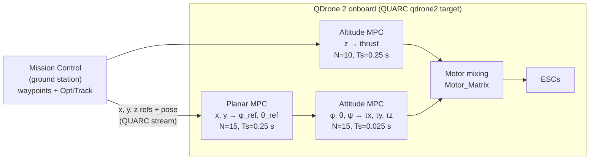

# Cascaded MPC Flight Control for the Quanser QDrone 2

Three cascaded linear MPC controllers (altitude, attitude, and planar x-y position) running onboard a **Quanser QDrone 2** through QUARC. The controllers are built in MATLAB and Simulink on top of Quanser's QDrone 2 DroneStack, so they reuse its sensing, communication, and motor interfaces.

> Featured in the [Quanser Community Showcase](https://github.com/quanser/Quanser_Academic_Resources/tree/dev-windows/8_user_content/2_research/TecnologicoDeMonterrey_CarlosHernan_QDrone2_CascadedMPC).

## Architecture



| Layer    | State                | Input                    | Horizon N | Ts      | Preview |
|----------|----------------------|--------------------------|-----------|---------|---------|
| Altitude | `[z ż]`              | total thrust             | 10        | 0.25 s  | 2.5 s   |
| Attitude | `[φ φ̇ θ θ̇ ψ ψ̇]`      | `[τx τy τz]`             | 15        | 0.025 s | 0.375 s |
| Planar   | `[x ẋ y ẏ]`          | `[φ_ref θ_ref]` → attitude | 15      | 0.25 s  | 3.75 s  |

The attitude loop runs 10× faster than the outer loops, so each layer can treat the one below it as already settled. The altitude model carries gravity as a known disturbance term (`F4`), so the hover thrust is part of the prediction instead of being left to feedback. The planar layer uses the small-angle model `ẍ ≈ g·φ`, `ÿ ≈ −g·θ`.

**Sensing:** dual onboard IMU for attitude, the QDrone 2 height sensor, and OptiTrack position streamed from the Mission Control model.

## How the MPC is solved

Every layer uses the condensed formulation: predict over `N` steps and stack the inputs into `U`, which gives the QP

```
min_U  ½ Uᵀ H U + Fᵀ U
```

`H` depends only on the model and the weights, so `Setup_QDrone2_MPC.m` computes it **offline**. Online, the model only assembles `F` from the current state, the reference, and (for altitude) gravity, and then solves the problem in closed form:

```matlab
y = (-H)\F;     % MATLAB Function block in each MPC layer
```

The first move is applied (receding horizon), and **Saturation blocks** clamp thrust, torques, and angle commands to the hardware limits.

This is a deliberate trade-off. There is no iterative solver, so the solve time is deterministic and small: a 10×10, 45×45, or 30×30 linear system per step. That keeps the code generation for the QDrone 2 target simple. The cost is that the limits are applied *after* the optimization rather than *inside* it.

### Constrained version (prepared, not active)

The constrained QP is already formulated in the repository:

- `Ineq_Calc.m` builds `Aineq·U ≤ G1·x + G3` for the output (angle and position) bounds.
- `InConstraints.m` builds the input bounds over the whole horizon.
- The MPC blocks contain commented-out `quadprog` and `mpcActiveSetSolver` calls.

To make it active, feed `Aineq` and `G1·x + G3` into the solver blocks, switch them to `mpcActiveSetSolver` (which supports code generation), and compare limit violations and solve time against the closed-form version. Contributions are welcome.

## Repository contents

| File | Purpose |
|------|---------|
| `Setup_QDrone2_MPC.m` | Parameters, models, weights, horizons; builds `H`, `F*`, constraint matrices and `Motor_Matrix`. **Run first.** |
| `Cost_Funct.m` | Condensed MPC matrices `H`, `F1..F4`, prediction matrices `Φ`, `Ψ`. |
| `Ineq_Calc.m`, `InConstraints.m` | Inequality / bound matrices for a constrained solver. |
| `Pi_i.m` | Selector for step *i* in a stacked horizon vector. |
| `Motor_Mapping_7_Inch.m` | Thrust/torque → per-motor command mixing matrix. |
| `QD2_DroneStack_CompleteMPC_2021a.slx` | Onboard model (QUARC `quarc_linux_qdrone2` target): the three MPC layers, saturations, sensing, motors. |
| `QD2_MissionCtrl.slx` | Ground-station Mission Control (joystick / OptiTrack, streams references and pose to the drone). |
| `QD2_MissionCtrl_PipeWaypoints.slx` | Mission Control variant that sequences the drone through a predefined waypoint list. |

## Running it

Requirements: MATLAB and Simulink (the models were saved in R2022a), the Control System Toolbox (`c2d`), QUARC with QDrone 2 support, and an OptiTrack setup for x-y position.

1. Run `Setup_QDrone2_MPC` in MATLAB. It puts all the MPC matrices in the base workspace.
2. Open `QD2_DroneStack_CompleteMPC_2021a.slx`, then build and deploy it to the QDrone 2 with QUARC.
3. On the ground station, open `QD2_MissionCtrl.slx` (or the waypoint variant) and check that the IP addresses in the stream blocks match your network. Run it with QUARC and arm the drone.

To retune a layer, edit `Qy_*`, `Qu_*`, `N_*`, or `ts_*` in `Setup_QDrone2_MPC.m`. Then re-run the script and rebuild the model.

## Ideas to extend

- Activate the constrained QP (see above) and measure violations and solve time.
- Swap one layer for the stock DroneStack PID and compare tracking error and motor effort on the same trajectory.
- Sweep horizon length versus tracking performance and compute time.
- Replace the step changes between waypoints with smooth reference trajectories, so the planar MPC can use its 3.75 s of preview.

## Authors

- **Carlos Auquilla**: design and implementation
- **David Sotelo**: advisor
- **Carlos Sotelo**: advisor
- **Luis Muñoz**: advisor

Tecnológico de Monterrey. Built on Quanser's QDrone 2 DroneStack models.

Questions, bugs, and contributions: please open a [GitHub Issue](https://github.com/carlos2219/MPC_Drone_quanser/issues).

If you use this work, see `CITATION.cff` (GitHub's *Cite this repository* button).

## References

- J. B. Rawlings, D. Q. Mayne, M. M. Diehl, *Model Predictive Control: Theory, Computation, and Design*, 2nd ed., Nob Hill, 2017.
- F. Borrelli, A. Bemporad, M. Morari, *Predictive Control for Linear and Hybrid Systems*, Cambridge University Press, 2017.
- S. Boyd, L. Vandenberghe, *Convex Optimization*, Cambridge University Press, 2004.
- R. W. Beard, T. W. McLain, *Small Unmanned Aircraft: Theory and Practice*, Princeton University Press, 2012.
- Quanser, QDrone 2 documentation and DroneStack resources: [Quanser Academic Resources](https://github.com/quanser/Quanser_Academic_Resources).

## License

MIT. See `LICENSE`.
